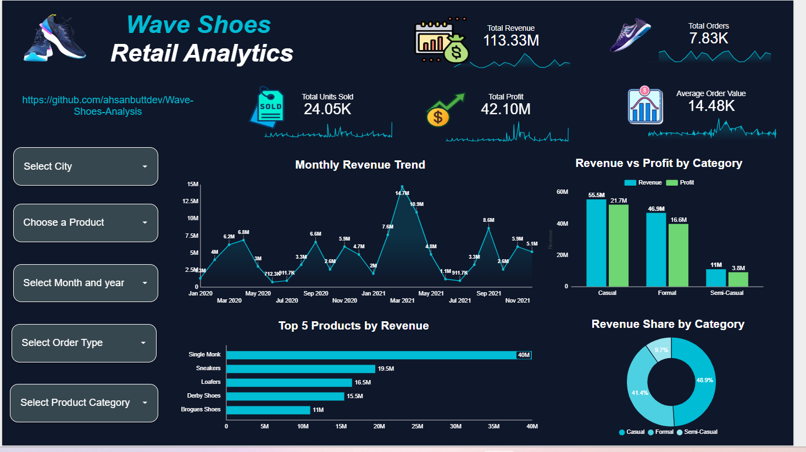

# Wave Shoes Retail Analytics

A comprehensive, end-to-end data engineering and business intelligence project analyzing sales performance, revenue trajectories, and product metrics for Wave Shoes. This project demonstrates relational database manipulation using PostgreSQL and executive-level dashboard reporting.

## 📊 Project Overview
This repository contains a production-ready analytics solution designed to transform raw transactional retail logs into structured business intelligence. The core objective is to deliver data-driven clarity on revenue health, customer purchasing behavior, and inventory performance.

## 🛠️ Tech Stack & Tools
* **Database Engine:** PostgreSQL 
* **Business Intelligence:** Looker Studio (Interactive data visualization and dashboard design)
* **Version Control:** GitHub

---

## 📁 Repository Structure
* **SQL/**
  * `Wave_shoes.sql` — Main PostgreSQL script containing all schema modifications, data cleaning steps, and core analytical queries.
* `wave_shoes_dashboard.png` — High-resolution production screenshot of the final reporting interface.
* `README.md` — Project documentation and execution guide.

---

## 💻 Database Implementation & Analytics (PostgreSQL)
The data pipeline and analytical logic were constructed entirely within a PostgreSQL environment. The complete production script is located inside the `SQL/Wave_shoes.sql` file and covers:

* **Data Cleaning & Standardization:** Standardizing string fields, handling missing transactional fields, and optimizing data types for indexing.

---

## 📈 Executive Dashboard Visuals

The visualization layer provides a high-impact overview of business performance, designed for stakeholders to evaluate critical KPIs at a single glance.

### Production Interface
Below is the direct rendering of the final executive dashboard layout:

### Core Dashboard Features:
* **Dynamic Slicers:** Left-aligned interactive filters allowing stakeholders to drill down by dates, regions, and product types.
* **Financial Trajectory:** High-contrast line charts tracking month-over-month revenue velocity.
* **Categorical Volume:** Clean distributions identifying the highest-grossing product lines to optimize inventory.
